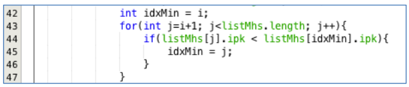
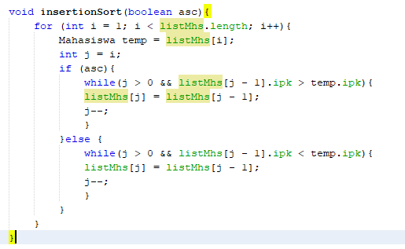

# Tugas Bubble, Selection, and Insertion Sort
## Pertanyaan 5.2.3
1. Terdapat di method apakah proses bubble sort?   
jawab : Terdapat di method void bubbleSort(){

2. Terdapat di method apakah proses selection sort?   
jawab : Pada praktikum 5.2 ini belum terdapat atau tidak ada proses selection sort.
3. Apakah yang dimaksud proses swap? Tuliskan potongan program untuk melakukan proses swap tersebut!   
jawab : Proses swap merupakan terjadinya pertukaran posisi angka dengan tujuan pengurutan angka, pengurutan bisa dari kecil ke besar(ascending) atau dari besar ke kecil(descending).
4. Di dalam method bubbleSort(), terdapat baris program seperti di bawah ini:

Untuk apakah proses tersebut?   
jawab : Program tersebut digunakan untuk proses pengurutan descending, yaitu awal dilakukan pengecekan kondisi apakah angka di disebelahnya elemen (j) lebih besar dari elemen (j-1), apabila memenuhi maka akan dilakukan swap atau pertukaran pada 2 elemen tersebut. 
5. Perhatikan perulangan di dalam bubbleSort() di bawah ini:  

a. Apakah perbedaan antara kegunaan perulangan i dan perulangan j?   
jawab :   
   - Perulangan i (luar) digunakan untuk pergantian pengecekan pada setiap baris sebanyak panjang baris array
   - perulangan j (dalam) digunakan untuk pengecekan pada setiap kolom sebanyak panjang satu kolom array yaitu pengecekan dilakukan untuk proses pertukaran elemen atau swap dan sebaliknya.  

   b. Mengapa syarat dari perulangan i adalah i < listMhs.length-1?
   jawab : karena pada perulangan untuk mengecek pada array listMhs, jadi kondisi mengacu dibatasi pada panjang array listMhs dikurangi 1 karena i dimulai dari 0. 

   c. Mengapa syarat dari perulangan j adalah j < listMhs.length-i?
   jawab : Looping dibatasai dengan kondisi listMhs dikurangi i sehingga berfungsi sebagai batas dari proses swap dan no swap

   d. Jika banyak data di dalam listMhs adalah 50, maka berapakali perulangan i akan berlangsung? Dan ada berapa Tahap bubble sort yang ditempuh?
   jawab : Berulang sebanyak 49 kali, dengan banyak tahap 1225 kali dengan cara menghitung perderet.

## Pertanyaan 5.3.3
Di dalam method selection sort, terdapat baris program seperti di bawah ini:  

Untuk apakah proses tersebut, jelaskan!   
jawab : pada proses ini dilakukan pengecekan kondisi dengan mencari elemen terkecil, yaitu dengan perbandingan nilai awal dibandingkan dengan nilai terkecil apabila memenuhi maka indeks nilai terkecil akan diperbaharui, serta nilai terkecil akan bertukar tempat dengan nilai awal yang dibandingkan. Pengecekan kondisi dilakukan sampai kondisi perulangan tercapai.

## Pertanyaan 5.4.3
Ubahlah fungsi pada InsertionSort sehingga fungsi ini dapat melaksanakan proses sorting
dengan cara ascending atau decending, anda dapat melakukannya dengan menambahkan parameter tipe boolean pada pemanggilan fungsi insertionSort.  
jawab :

